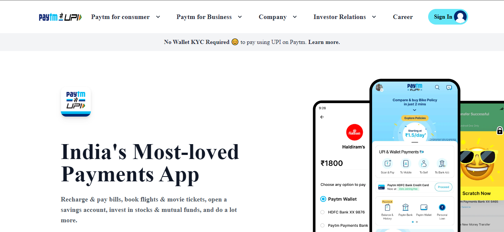

# Project 15: Product Design LandingPage using HTML and Tailwind CSS

Chandrakala P

## Final Look of the Webpage:

### Live project Link:

[project link](https://pay-tm-clone.netlify.app/)

## What I learnt from this Project?

- This project helped me to understand the whole idea of Html and css.
- I learnt most of the basics tags in html and many properties in css.
- It helped me to understand more about Tailwind css and the learnt most of the classes in Tailwind

## Stacks and Tools:

- HTML and Tailwind CSS
